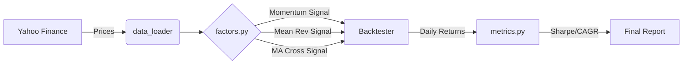

# Quant Trading Research Project

## Overview
This repository contains a modular Python framework designed for researching, backtesting, and evaluating factor-based trading strategies on cryptocurrency markets (BTC-USD and ETH-USD). The project aims to provide a clean, extensible codebase for quantitative finance research, allowing users to easily implement new signals, run vectorised backtests, and analyze performance metrics.

The core of the project is a custom backtesting engine located in `quant-factor-backtest/`, which handles data ingestion, signal generation, and performance reporting.

## Project Structure

### 1. Codebase: `quant-factor-backtest/`
This directory contains the core Python implementation.
- **`src/`**:
    - `data_loader.py`: Fetches historical price data from Yahoo Finance.
    - `factors.py`: Implements trading signals (Momentum, Mean Reversion, MA Crossover).
    - `backtester.py`: Vectorised backtesting engine that simulates trades and calculates equity curves.
    - `metrics.py`: Calculates key performance indicators (CAGR, Sharpe Ratio, Volatility, Max Drawdown).
    - `plotting.py`: Visualization tools for equity curves and drawdowns.
- **`notebooks/`**: Interactive Jupyter notebooks (e.g., `factor_research.ipynb`) for deep-dive analysis and visualization.
- **`run_analysis.py`**: A standalone script for **reproducible execution**. While notebooks are great for exploration, this script allows the entire backtest to be run in a single command. This demonstrates a "production-ready" mindset where research can be automated or run on servers without a GUI.


### 2. Research Documentation
- **Report**: A detailed PDF covering the thought process, methodology, and findings will be available in this root directory.

## System Architecture

The following diagram illustrates the data flow through the backtesting system:



### How It Works
1.  **Data Loading (`data_loader.py`)**: Fetches historical close prices from Yahoo Finance.
    *   **Smart Caching**: Automatically saves downloaded data to `data/prices.csv`. On subsequent runs, it loads from this local cache instantly, enabling offline work and faster execution.
2.  **Signal Generation (`factors.py`)**: Calculates trading signals (+1 Buy, -1 Sell) based on logic (Momentum, Mean Reversion, MA Crossover).
3.  **Backtesting (`backtester.py`)**: Simulates trades by shifting signals forward one day (to avoid lookahead bias) and calculating daily strategy returns.
4.  **Metrics (`metrics.py`)**: Computes performance statistics like Sharpe Ratio, CAGR, and Max Drawdown from the daily returns.


## Strategies Implemented
The project currently implements three classic quantitative strategies:

1.  **Momentum**: A trend-following strategy that buys when the price is higher than it was $N$ days ago (and sells otherwise). It capitalizes on the tendency of assets to persist in their direction of movement.
2.  **Mean Reversion**: A contrarian strategy that uses Z-scores of price deviations from a moving average. It sells when prices are statistically "expensive" (overbought) and buys when they are "cheap" (oversold).
3.  **Moving Average Crossover**: A trend-following strategy that generates buy signals when a short-term moving average crosses above a long-term moving average (Golden Cross) and sell signals when it crosses below (Death Cross).

## Dataset
- **Source**: Yahoo Finance (`yfinance`)
- **Assets**: BTC-USD, ETH-USD
- **Period**: Configurable (Default: 2020-01-01 to 2023-12-31 for analysis)

## How to Run

### Prerequisites
Ensure you have Python installed. Install the required dependencies:

```bash
cd quant-factor-backtest
pip install -r requirements.txt
```

### Option 1: Run the Analysis Script
To quickly run the backtest for all strategies and see the performance metrics in your terminal:

```bash
python run_analysis.py
```

### Option 2: Interactive Research
For charts and interactive exploration:
1.  Launch Jupyter Lab or Notebook:
    ```bash
    jupyter lab
    ```
2.  Open `notebooks/factor_research.ipynb`.
3.  Run all cells to execute the backtest and view detailed plots.

## Example Results (2020-2023)
*Note: Results vary based on the selected time period.*

In a recent backtest from 2020 to 2023, the **Moving Average Crossover** strategy on BTC-USD showed promising risk-adjusted returns.

**Key Observations:**
*   **MA Crossover** significantly reduced drawdown (-51%) compared to Buy & Hold (-76%), resulting in a decent **Calmar Ratio**.
*   **Momentum** had a ~50% daily win rate but captured large trends.
*   **Mean Reversion** performed poorly, indicating that simple Z-score strategies struggle in the strongly trending crypto markets without regime filters.

| Strategy | Asset | CAGR | Sortino | Calmar | Max Drawdown | Win Rate |
| :--- | :--- | :--- | :--- | :--- | :--- | :--- |
| **MA Crossover** | BTC-USD | ~30% | 0.65 | 0.59 | -51% | 49% |
| **Momentum** | BTC-USD | ~24% | 0.51 | 0.40 | -59% | 50% |
| **Buy & Hold** | BTC-USD | ~35% | 0.61 | 0.46 | -76% | 51% |

*Metrics Explanation:*
*   **Sortino Ratio**: Like Sharpe, but only penalizes *downside* volatility (bad risk).
*   **Calmar Ratio**: CAGR / Max Drawdown. Higher is better (more return for less crash).
*   **Win Rate**: Percentage of days with positive returns.
